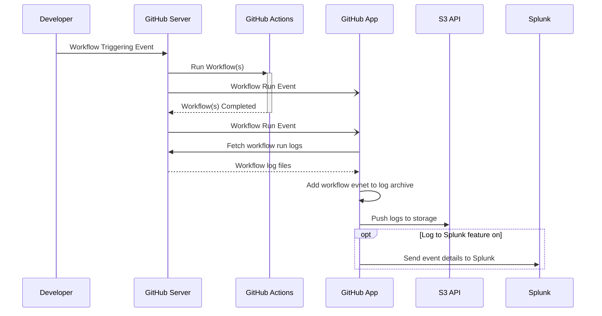

# Workflow Log Archiver
This is a GitHub application that enables archiving the log files of any workflow run where the application is installed.
While GitHub is working to expand functionality and usability in this area, there presently is not a feature that properly addresses these needs.
This GitHub App is installed into a GHES instance and listens for any workflow that is completed; regardless of success or failure.
It then processes the event by downloading the associated log files and stores them in a location that meets auditing requirements.
This ensures that if someone accidentally or intentionally clears the workflow logs on the GHES instance, they have been safely archived and retained.

## How it Works
This GitHub App leverages webhooks to know when a workflow has completed to safely archive the associated log files.
Once a developer causes an event that can trigger a wofkflow, such as a `git push` or a pull request, GHES starts the affected workflow(s).
This sends a workflow run event to the GitHub App and is immediately evaluated.
If the workflow run is not completed, the GitHub App stops processing the event.
Once a workflow completes, antoher event is sent to the GitHub App.
This time the workflow run is completed so we are able to take action on it.
The GitHub App connects to the GHES API and downloads the binary data for log files.
These files are already in a zip archive but lack details around the workflow event itself; i.e., they just contain the raw output from the workflow run.
The GitHub App serializes the workflow run event details into a JSON file and this file is then added to that archive.
The log files are then pushed to an S3 API endpoint to ensure they are retained.
In addition, a feature flag is evaluted to see if summary data should be pushed into Splunk.
The purpose of this is to allow for easy searching and indexing of the data being pushed into the S3 API endpoint.

## How to Use it

* [Developing](/docs/developing.md)
* [Deploying](docs/deploying.md)
* [Installation](docs/installation.md)
