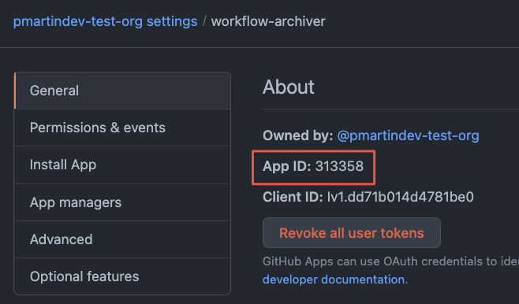

# Developing the GitHub App
This GitHub App was developed to be self-contained when doing local development.
It leverages Docker Compose to stand up the necessary containers to run the GitHub Application locally.
The sections below detail how to get the project up and running to do local developent

## Running Locally
In order to get started working with running the application locally, there are several perquisites you will need to ensure are setup and ready to go.

### IDE
This project was setup to use Visual Studio 2022 but that is not a hard requirement.
It is possible to use another IDE, such as Visual Studio Code or JetBrains Rider, to debug the application with.
If you wish to use another IDE, you will need to take additional setup steps to debug the application from that IDE.

### .NET
Once you have the source code locally on your machine, we need to make sure you have the right .NET SDK installed on your machine.
You will need to make sure you have .NET 7.0 installed on your machine.
To verify this, run the following command:

```shell
# An example of how to check on a Windows based machine
PS> dotnet --list-sdks
7.0.100 [C:\Program Files\dotnet\sdk]
```

Depending on your development environment, you may have a newer patch version that listed in the example above.
As long as you have `7.0.x` installed, you should have no issues with running the code.

After verifying your installation, you will need to create and trust the dotnet dev certificates. 
1. Navigate to the app directory `cd GitHub.App.Workflows.WebApi`
2. Clean up & create the new certificate with a password `dotnet dev-certs https --clean && dotnet dev-certs https -ep ~/.aspnet/https/GitHub.App.Workflows.WebApi.pfx -p 2b74f1f8-e9eb-4369-b130-9b5454a692ce`
3. While in the app directory, set the development password .NET secret, `dotnet user-secrets set "Kestrel:Certificates:Development:Password" "2b74f1f8-e9eb-4369-b130-9b5454a692ce"`

### Docker or Equivalent
This project leverages Docker Compose to run the necessary dependencies to run and debug the GitHub App locally.
Docker Desktop was used during the development of this application, but any containerzation platform that understands how to launch a Docker Compose project will work as well.

## `Octokit.Webhooks` and `Octokit.Webhooks.AspNetCore` Packages
This GitHub App uses two publically available NuGet packages `Octokit.Webhooks` and `Octokit.Webhooks.AspNetCore`.
These packages are published by GitHub to simplify creating a .NET Core Web API application to listen for webhook events from GitHub.
Using these packages sets up a well known route of `/api/github/webhooks` that you can point any GitHub webhook event too.

For additional details on these packages, checkout the [`octokit/webhooks.net`](https://github.com/octokit/webhooks.net) repository for documentation and examples.

## smee.io
When developing GitHub Apps locally, you need a way for your GHES instance to send the webhook events to your local machine.
GitHub recommends using [smee.io](https://smee.io) to do this.
This tool will give you a publicly accessible endpoint that provides SSL/TLS support.
You are then able to run a local client that will proxy the request to your local machine.
For details on running this locally, please see [Setting up your development environment to create a GitHub App](https://docs.github.com/en/enterprise-server@3.5/developers/apps/getting-started-with-apps/setting-up-your-development-environment-to-create-a-github-app).

Once you have a channel established, run the following command to start your client:
```shell
$ smee -u https://smee.io/[your-channel-id] -P /api/github/webhooks
```

## Installing or Registering the GitHub App
Once your [smee.io](https://smee.io) channel is established, you can now register/install the GitHub App for local development.
The steps to do this can be found in the [installation](installation.md) document.

## Local .NET Secrets
After you have successfully installed or registered the GitHub App, sevral values used during the install or geistration must be set as .NET user secrets.

### GHES API URL
The first value needed is the URL for the API of the GHES instance.
This is set on a per oganization basis to allow for multiple GHES instances.
The need for this in a secret is to minimize code churn the configuration files as this could be updated at any point.
The configuration for this value is `GitHub:[organization name]:ApiUrl`.
Executing the following command from the `src\GitHub.App.Workflows.WebApi` folder with your API URL and it will set this value (assuming the GitHub organization that has the application installed is called `gh-app` and your API URL is `https://ghes.localdev.me/api/v3`).
```shell
$ dotnet user-secrets set "GitHub:gh-app:ApiUrl" "https://ghes.localdev.me/api/v3"
```

### Webhook Client Secret
Next, you will need to set the secret that is being used for the webhooks.
This should be kept out of Git as this could introduce security risks.
The configuration for this value is `GitHub:ClientSecret`.
Executing the following command from the `src\GitHub.App.Workflows.WebApi` folder with your API URL and it will set this value.
```shell
$ dotnet user-secrets set "GitHub:ClientSecret" "some random string that should be kept safe"
```

### Application ID
You will need set the Application ID of the GitHub App **for each** organization you install the application to.
This can be found on the GitHub App settings page:

The need for this in a secret is to minimize code churn the configuration files as this could be updated at any point.
The configuration for this value is `GitHub:[organization name]:ApplicationId`.
Executing the following command from the `src\GitHub.App.Workflows.WebApi` folder with your Application ID and it will set this value (assuming the GitHub organization that has the application installed is called `gh-app` and Application ID is `3`).
```shell
$ dotnet user-secrets set "GitHub:gh-app:ApplicationId" "3"
```

### Private Key
After the applciation has been successfull installed or registered, you will need a private key for the application to authenticate against the GitHub API.
This can be generated by clicking the **Generate a private key** button from the GitHub App settings page.

```shell
$ dotnet user-secrets set "GitHub:gh-app:PrivateKeyFilePath" "/keys/[PEM file name]"
```