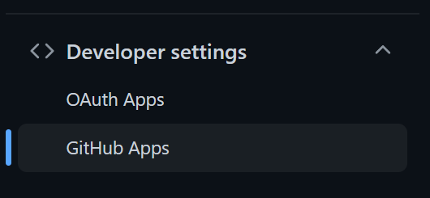
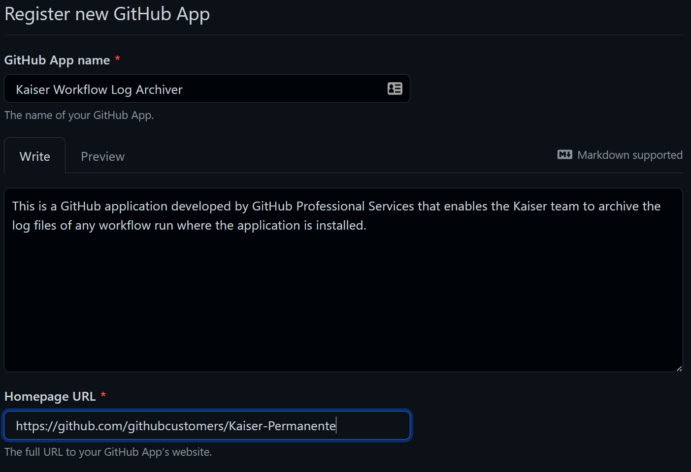
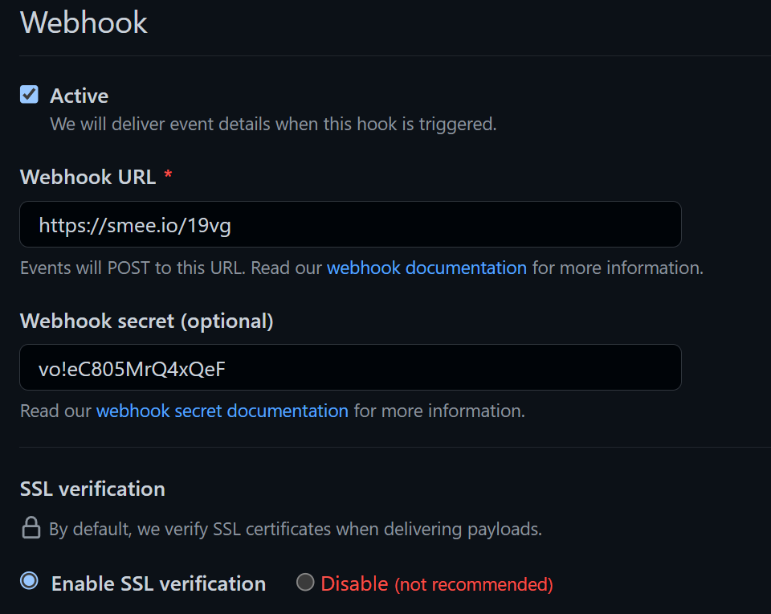
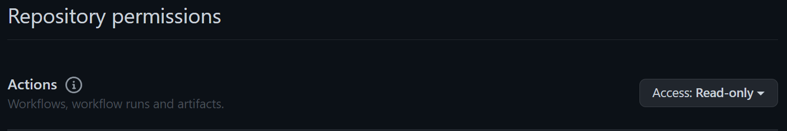
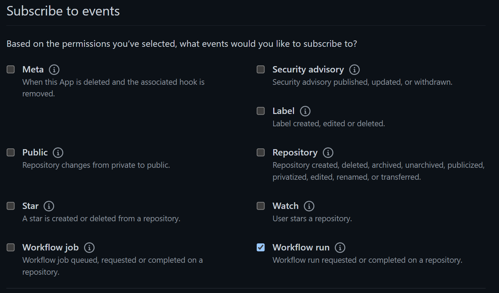

# Installation
To begin leveraging this GitHub App, we need to install or register it with at least one organization in your GHES instance.
At present, GitHub Apps are managed at the organization level in GHES.
This means that you will need to install or register the GitHub App in any organization you need it to collect workflow run logs.

## Install/Register GitHub App
Before registering the new GitHub App, you will need a URL for the webhook calls.
If this install is for local development, refer to the [Local Development](developing.md) documentation for getting a webhook URL.
If this install is for a hosted environment, such as developer or production, refer to the [Deploying the App](deploying.md) documentation.
To get started, follow the steps listed below.
There are additional reference and details can found at the links in the **Refernces** section.
Note that these settings can be modified *after* you create or register the GitHub App so if you do not have all of the values ready, place holders can be put in and updated at a later time.

1. Navigate to the Settings page for the organization
```
https://[FQDN GHES Instance]/organizations/[Target Organization]/settings
```
<br>

2. Expand the **<> Developer settings** section and select **GitHub Apps**

<br>

3. Click the **New GitHub App** button in the upper right of the screen <br>

4. Fill out the **GitHub App name**, **Homepage URL**, **Webhook** boxes and ensure webhooks are active <br>


>***Note:** You should provided a webhook secret which should be a randomly generated string. Ensure this value is kept in a safe place as you will not be able to retrieve this value after you leave the screen*<br>
>***Note:** HTTPS verification is done by the GHES server when calling the webhook URL you specify. Which means the TLS certificate used by the webhook applciation must be signed by an authority trusted by the GHES instance.*<br>

5. Set repository permission for **Actions** to **Access: Read-only**


6. Subscribe to the **Workflow run** events


7. Click **Create GitHub App**

## Generate Private Keys
This GitHub App needs the ability to call the GHES API in order to download the workflow run logs.
In order to do this, it has to authenticate against the GHES instance and this is achieved by signing an access token.
We have to use the GHES instance to generate a private key for the GitHub App that we will use to sign all access tokens with.
Simply click the **Generate a private key** which will download a PEM file which **is the private key**.
Store this in a safe location as it cannot be recovered.
If you do loose the private key, you are able to generate a new one by editing the GitHub App.

## References
- [Creating a GitHub App in GHES](https://docs.github.com/en/enterprise-server@3.5/developers/apps/building-github-apps/creating-a-github-app)
- [Installing GitHub App](https://docs.github.com/en/enterprise-server@3.5/developers/apps/managing-github-apps/installing-github-apps)
- [Modifying a GitHub App](https://docs.github.com/en/enterprise-server@3.5/developers/apps/managing-github-apps/modifying-a-github-app)
- [Edit permissions for a GitHub App](https://docs.github.com/en/enterprise-server@3.5/developers/apps/managing-github-apps/editing-a-github-apps-permissions)
- [Manage app visibility](https://docs.github.com/en/enterprise-server@3.5/developers/apps/managing-github-apps/editing-a-github-apps-permissions)
- [Authenticating with GitHub Apps](https://docs.github.com/en/enterprise-server@3.5/developers/apps/building-github-apps/authenticating-with-github-apps)
